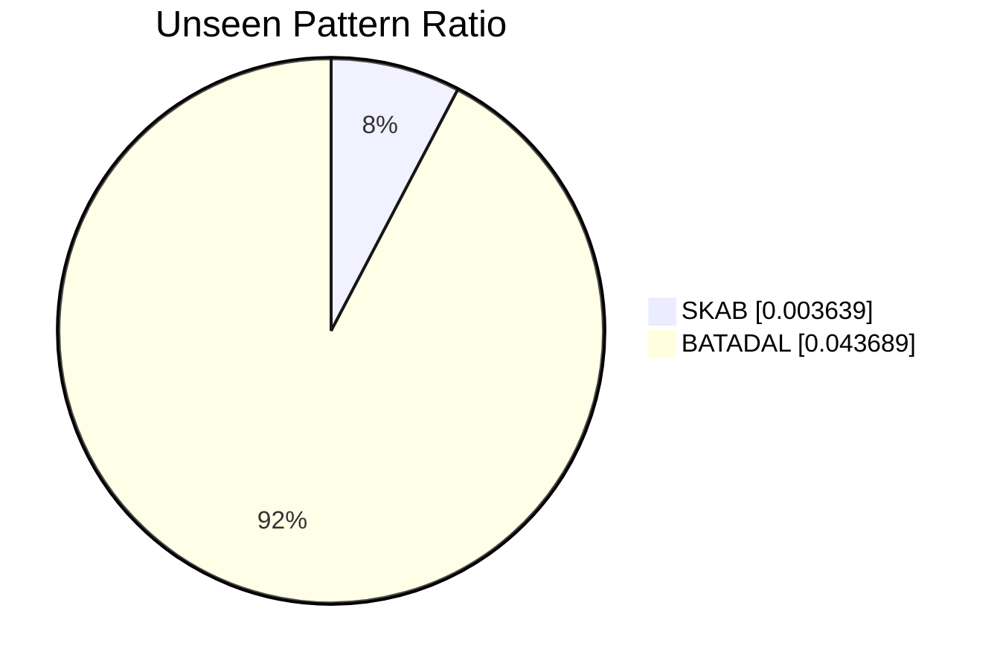

# probabilistic-automata-time-series

Bu repo, zaman serisi anomali tespitinde iki aileyi karşılaştırır:

- Olasılıksal otomata yaklaşımı
- Derin öğrenme tabanlı sıralı modeller (`LSTM`, `GRU`, `CNN`)

Guncel mimari artik `configs/models.yaml` dosyasindaki etkin (`enabled: true`) derin model tanimlarini otomatik kesfeder. `architecture` alani degistiginde veya yeni bir model eklendiginde deney dongusu ve model insasi kod degistirmeden yeniden kurulur.

## Teslim Ozeti

- Tam parametrik derin model akisi eklendi: `LSTM`, `GRU`, `CNN`
- `CNN` modeli artik gercek PyTorch implementasyonuyla calisiyor
- Her kosu icin preprocessing, noise, otomata, training ve model hiperparametreleri CSV/JSON ciktilarina yaziliyor
- Preprocessing pipeline'a opsiyonel eksik veri imputasyonu eklendi
- Ham veri audit'i yapildi: bu repodaki kullanilan BATADAL ve SKAB dosyalarinda eksik deger yok
- BATADAL hedef sutunu raporda acikca belirtildi: `ATT_FLAG`

## Veri Setleri

| Veri seti | Hedef sutunu | Not |
| --- | --- | --- |
| SKAB | `anomaly` | Grup bazli hold-out ve 5-fold benzeri grup ayrimi kullaniliyor |
| BATADAL | `ATT_FLAG` | `-999 -> 0`, `1 -> 1` olarak yeniden esleniyor |

Eksik veri denetimi:

- `data/raw/BATADAL/BATADAL_dataset04.csv`: `0` eksik deger
- `data/raw/SKAB/valve1/*.csv` ve `data/raw/SKAB/valve2/*.csv`: `0` eksik deger

Bu nedenle mevcut veriyle imputasyon fiilen tetiklenmiyor; yine de pipeline'da `preprocessing.missing_data` altinda destekleniyor.

## Mimari

- Derin model tanimlari: [configs/models.yaml](/C:/Users/Esma%20Nur%20Mant%C4%B1/Desktop/probabilistic-automata-time-series/configs/models.yaml)
- Dinamik derin model deneyi: [src/experiments/run_deep_models.py](/C:/Users/Esma%20Nur%20Mant%C4%B1/Desktop/probabilistic-automata-time-series/src/experiments/run_deep_models.py)
- CNN implementasyonu: [src/models/deep_learning/cnn_model.py](/C:/Users/Esma%20Nur%20Mant%C4%B1/Desktop/probabilistic-automata-time-series/src/models/deep_learning/cnn_model.py)
- Preprocessing: [src/data/preprocessing/preprocessing_pipeline.py](/C:/Users/Esma%20Nur%20Mant%C4%B1/Desktop/probabilistic-automata-time-series/src/data/preprocessing/preprocessing_pipeline.py)
- Logging: [src/utils/logger.py](/C:/Users/Esma%20Nur%20Mant%C4%B1/Desktop/probabilistic-automata-time-series/src/utils/logger.py)

## Model Karsilastirmasi

Asagidaki tablo, guncel `results/tables/deep_learning_metrics.csv` ciktilarinin 5 seed ortalamalarini ozetler.

| Dataset | Model | Accuracy (mean) | F1 (mean) |
| --- | --- | ---: | ---: |
| SKAB | CNN | 0.6643 | 0.2845 |
| SKAB | GRU | 0.6633 | 0.2750 |
| SKAB | LSTM | 0.6618 | 0.2570 |
| BATADAL | CNN | 0.8660 | 0.0000 |
| BATADAL | GRU | 0.8655 | 0.0404 |
| BATADAL | LSTM | 0.8609 | 0.0030 |

Otomata tarafinda mevcut artefaktlar:

| Dataset | Family | Accuracy | F1 | Ortalama unseen ornegi |
| --- | --- | ---: | ---: | ---: |
| SKAB | Automata | 0.6132 | 0.0932 | 20.6 |
| BATADAL | Automata | 0.7282 | 0.2821 | 9.0 |

Yorum:

- SKAB'ta derin modeller otomata ailesini belirgin sekilde geciyor.
- BATADAL'da accuracy yuksek olsa da derin modellerin anomaly recall/F1 davranisi zayif; bu veri setinde sinif dengesizligi daha kritik.
- Mevcut derin model kosularinda SKAB icin en iyi ortalama F1 `CNN`, BATADAL icin ise `GRU`.

## Noise Analizi

`results/tables/noise_experiment_metrics.csv` dosyasindaki mevcut artefaktlar su egilimleri gosteriyor:

- SKAB derin modellerinde gaussian noise etkisi sinirli; LSTM F1 `0.3883 -> 0.3864`, GRU F1 `0.3526 -> 0.3535`
- SKAB automata F1 degeri hafif iyilesiyor: `0.0355 -> 0.0393`
- BATADAL derin modellerinde kayitli snapshot'ta noise etkisi yok denecek kadar az
- BATADAL automata F1 degeri hafif artiyor: `0.2821 -> 0.2933`

## Unseen Analizi

`results/tables/unseen_metrics.csv` ozetine gore:



| Dataset | Total pattern | Unseen pattern | Unseen ratio | Avg distance | Avg confidence |
| --- | ---: | ---: | ---: | ---: | ---: |
| SKAB | 1374 | 5 | 0.003639 | 1.0 | 0.75 |
| BATADAL | 206 | 9 | 0.043689 | 1.0 | 0.75 |

Yorum:

- BATADAL, SKAB'a gore daha fazla unseen pattern uretiyor
- Her iki veri setinde de mapping success rate `1.0`
- BATADAL tarafinda unseen paternlerin anomaly ile iliskisi daha yuksek

## Parametre Etkisi

`results/tables/parameter_analysis_metrics.csv` icindeki en iyi F1 kombinasyonlari:

| Dataset | En iyi window_size | En iyi alphabet_size | F1 | Accuracy | Unseen |
| --- | ---: | ---: | ---: | ---: | ---: |
| SKAB | 6 | 5 | 0.1741 | 0.5947 | 22 |
| BATADAL | 6 | 3 | 0.3889 | 0.5111 | 66 |

Genel egilim:

- `window_size` buyudukce state space ve unseen sayisi artiyor
- BATADAL'da daha buyuk pencere daha yuksek recall/F1 verse de accuracy hizla dusebiliyor
- SKAB daha muhafazakar bir trade-off sunuyor

## Deney Baglami ve Loglama

Her run artik su bilgileriyle kaydedilir:

- `experiment_context` JSON alani
- `context_preprocessing_*`
- `context_noise_*`
- `context_automata_*`
- `context_training_*`
- `context_model_config_*`

Bkz. guncel artefaktlar:

- [results/tables/deep_learning_metrics.csv](/C:/Users/Esma%20Nur%20Mant%C4%B1/Desktop/probabilistic-automata-time-series/results/tables/deep_learning_metrics.csv)
- [results/explanations/deep_learning_summary.json](/C:/Users/Esma%20Nur%20Mant%C4%B1/Desktop/probabilistic-automata-time-series/results/explanations/deep_learning_summary.json)
- [results/logs/project.log](/C:/Users/Esma%20Nur%20Mant%C4%B1/Desktop/probabilistic-automata-time-series/results/logs/project.log)

## Calistirma

```bash
python src/main.py
python src/experiments/run_automata.py
python src/experiments/run_deep_models.py
python src/experiments/run_noise_experiment.py
python src/experiments/run_unseen_experiment.py
python src/experiments/run_parameter_analysis.py
```

`src/experiments/generate_figures.py` ek figurler uretir; mevcut yerel ortamda `seaborn` eksik oldugu icin bu adim ayrica bagimlilik gerektirebilir.
