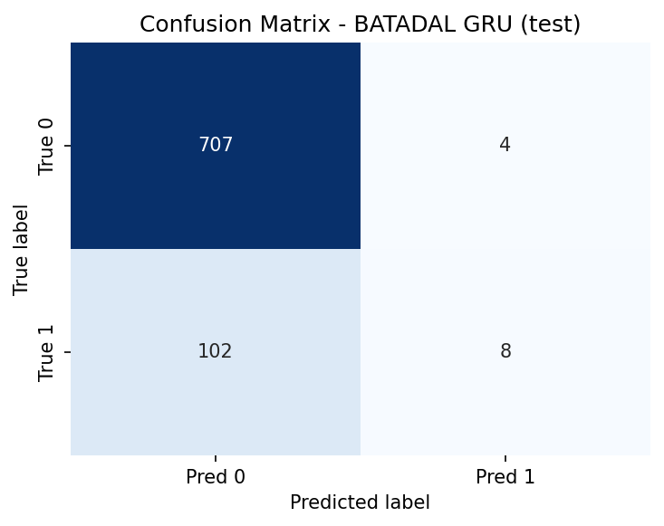
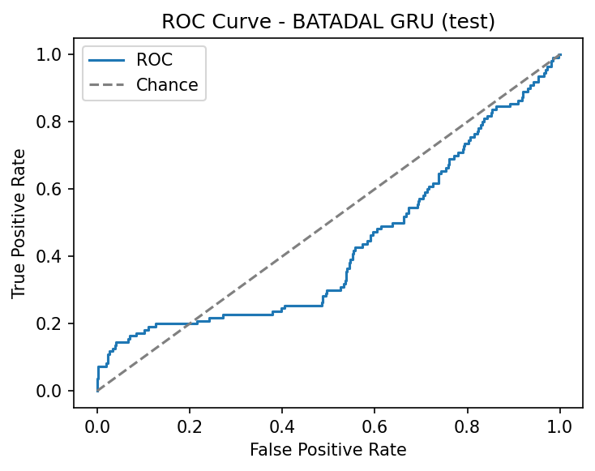
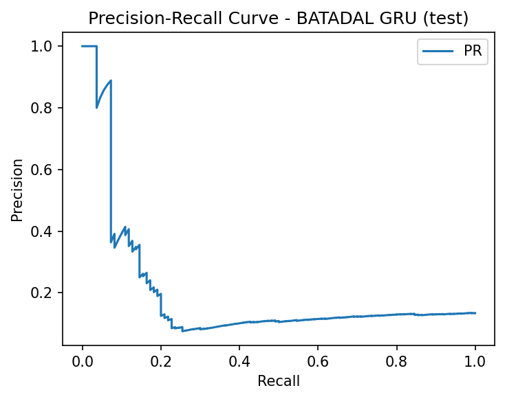
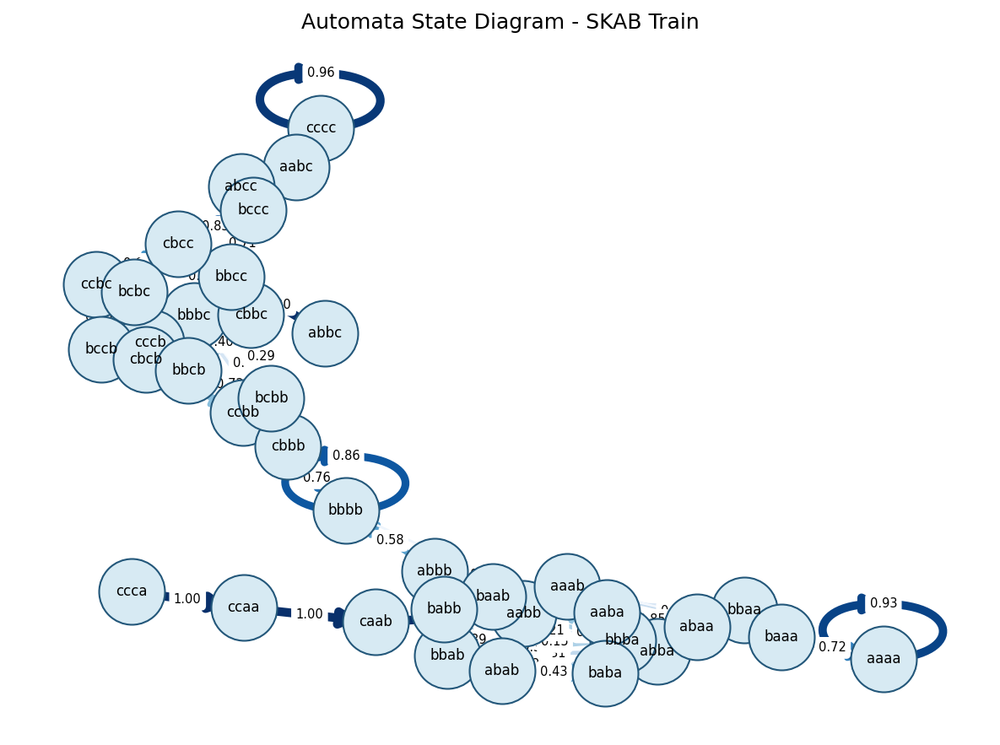
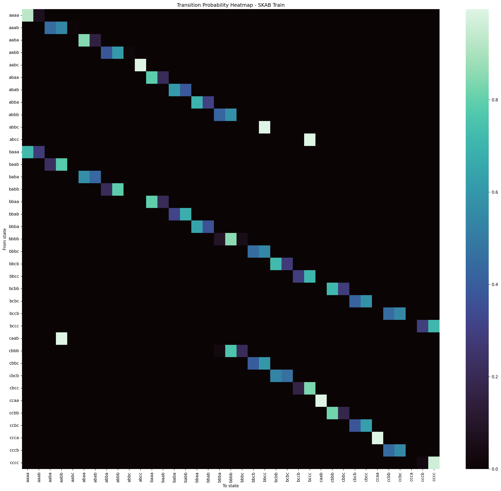
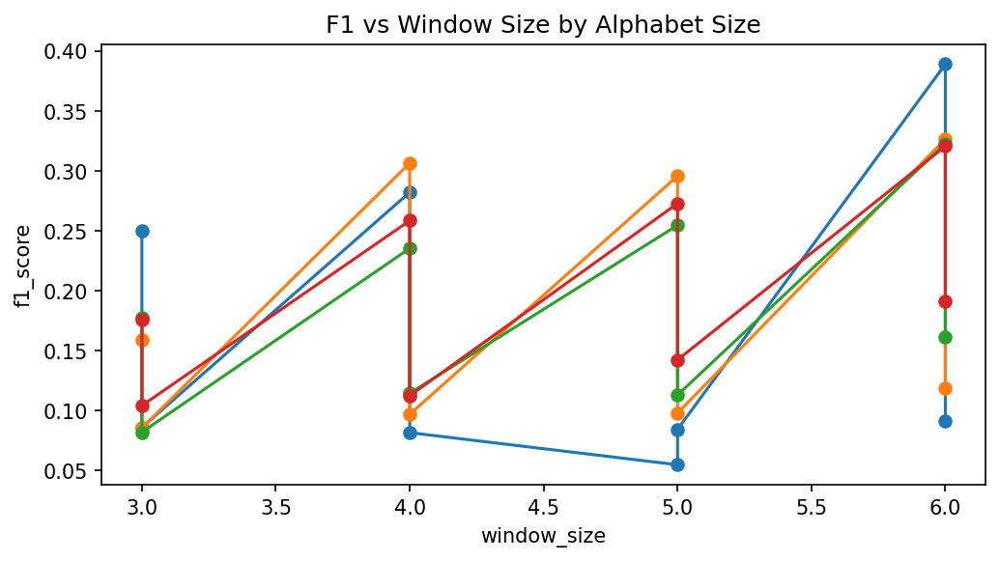
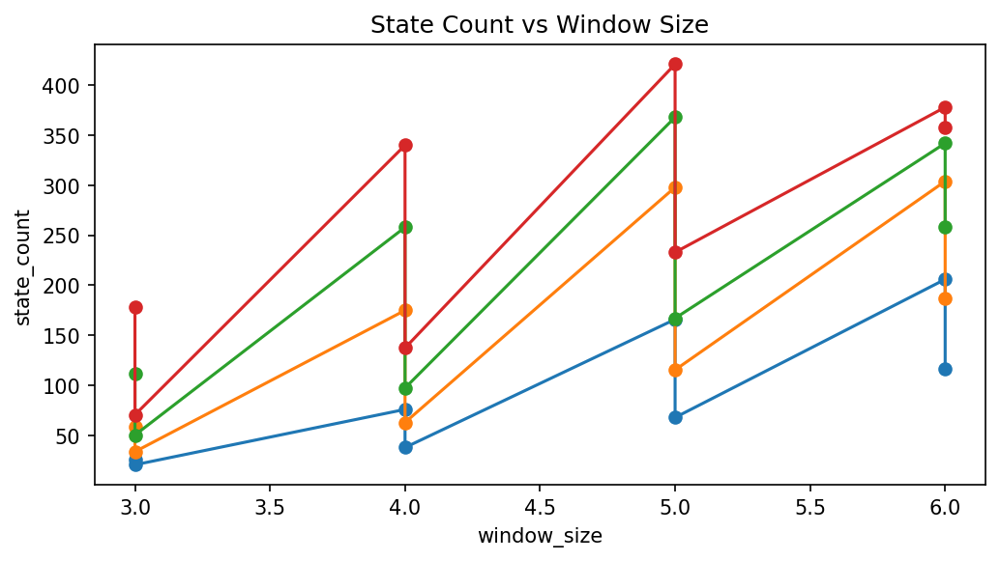
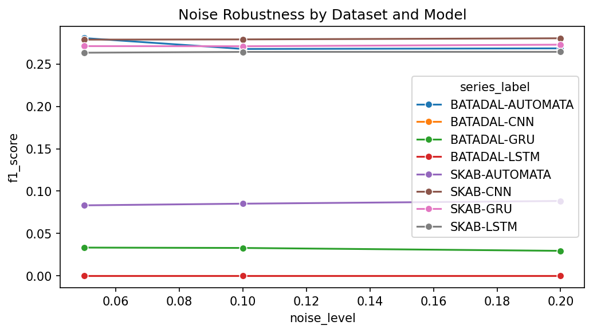
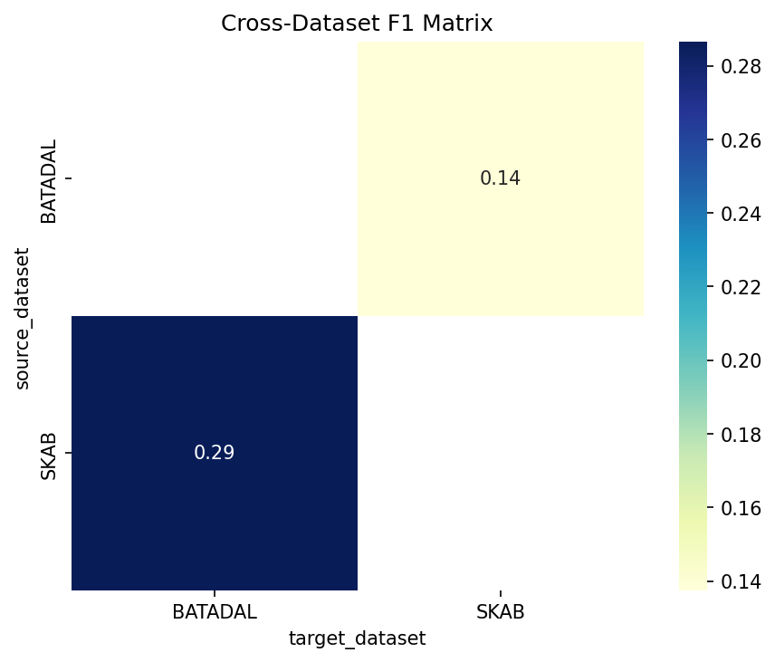
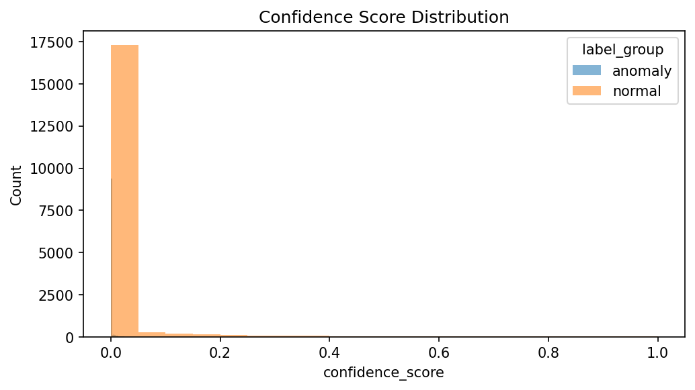

# Probabilistic Automata ile Zaman Serisi Anomali Tespiti

Bu proje, zaman serisi anomali tespitinde olasiliksal otomata tabanli sembolik bir yaklasimi derin ogrenme tabanli modellerle karsilastirmak icin gelistirilmistir. Calismada hem tahmin basarimi hem de aciklanabilirlik, gurultu dayanikliligi, unseen pattern yonetimi, capraz veri seti aktarimi ve calisma suresi gibi olcutler birlikte ele alinmaktadir. Repo, deneylerin yeniden uretilebilir bicimde calistirilmasini ve tum ara ciktilarinin kaydedilmesini hedefleyen tam bir deney hatti icerir.

## Veri Setleri

Bu calismada iki veri seti kullanilmistir:

- `SKAB`: Endustriyel ekipman sensorlerinden turetilen anomali senaryolari icerir. Bu projede yalnizca `valve1` ve `valve2` klasorleri kullanilmistir.
- `BATADAL`: Su dagitim sistemi saldiri/anomali senaryolarini icerir. Bu projede `BATADAL_dataset04.csv` dosyasi kullanilmis ve hedef etiket kolonu `ATT_FLAG` olarak islenmistir.

Bu iki veri seti birlikte secilmistir cunku biri fold-tabanli grup ayrimi gerektiren daha parcali bir yapi sunarken, digeri zaman sirali ve sinif dengesizligi yuksek bir gercekci degerlendirme ortami saglar. EK PDF sablonunda gecen `SWAT` ve `WADI` veri setlerinden farkli olarak bu repo yalnizca `SKAB` ve `BATADAL` uzerine kuruludur.

## Kurulum ve Calistirma

Bagimliliklari kurmak icin:

```bash
pip install -r requirements.txt
```

Tum deney hattini calistirmak icin:

```bash
python src/experiments/run_all.py --no-resume
```

Isterseniz asama bazli komutlar da dogrudan calistirilabilir:

```bash
python src/experiments/run_automata.py
python src/experiments/run_deep_models.py
python src/experiments/run_noise_experiment.py
python src/experiments/run_unseen_experiment.py
python src/experiments/run_cross_dataset_experiment.py
python src/experiments/run_parameter_analysis.py
python src/experiments/run_explainability_export.py
python src/experiments/run_runtime_analysis.py
python src/experiments/run_statistical_tests.py
python src/experiments/generate_figures.py
```

## Proje Mimarisi

Repo yapisi ozetle asagidaki bolumlerden olusur:

- `configs/`: Veri seti, model ve deney ayarlarini iceren YAML dosyalari.
- `data/`: Ham, islenmis ve bolunmus veri ciktilari.
- `src/data/`: Veri yukleme, donusturme ve split hazirlama bilesenleri.
- `src/models/`: Olasiliksal otomata ve derin ogrenme modellerinin uygulamalari.
- `src/evaluation/`: Metrikler, grafik uretimi ve istatistiksel test yardimcilari.
- `src/experiments/`: Tum deney scriptleri ve tam pipeline akisi.
- `src/utils/`: Config, seed, deney context'i ve yardimci altyapi kodlari.
- `results/`: Tablolar, aciklanabilirlik ciktilari, gorseller, runtime ve diger deney artefact'lari.
- `tests/`: Birim testler ve kabul testi niteligindeki dogrulamalar.
- `reports/`: README icine tasinmis rapor yapisinin eski yardimci kalintilari.

Merkezi giris noktalari:

- `configs/config.yaml`
- `configs/models.yaml`
- `configs/experiments.yaml`
- `src/experiments/run_all.py`
- `src/utils/experiment_context.py`

**Not - CSV Deney Kaydi Formati:** `results/tables/` altindaki ham CSV dosyalari her satirda tam deney context'ini JSON string olarak icerir (`context_` onekli kolonlar). Bu tasarim tam yeniden uretilebilirlik icin secilmistir; her satir hangi parametrelerle uretildigini kendi icinde tasir. Raporlama sirasinda yalnizca `dataset`, `model`, `split`, `f1_score_mean`, `f1_score_std` gibi ozet kolonlar kullanilir. Ozet tablolar ayrica `*_summary.csv` uzantisiyla kaydedilir.

## Veri On Isleme ve Bolme Stratejisi

On isleme hatti eksik deger isleme, olcekleme, PCA ile tek bilesene indirgeme ve sabit uzunluklu dizi uretiminden olusur.

`SKAB` icin:

- Veri yalnizca `valve1` ve `valve2` klasorlerinden alinir.
- Tum CSV dosyalari birlestirilir.
- `source_group` ve `source_file` alanlari izlenebilirlik icin korunur.
- Degerlendirme `source_file` bazli grup ayrimi mantigiyla fold yapisinda yurutulur.

`BATADAL` icin:

- `BATADAL_dataset04.csv` kullanilir.
- Etiket kolonu `ATT_FLAG` olarak sabitlenmistir.
- Zaman sirasi korunur.
- Bolme stratejisi `%60 train / %20 validation / %20 test` seklindedir.

Data leakage'i engellemek icin su kurallar uygulanir:

- scaler yalnizca train verisi uzerinde fit edilir
- PCA yalnizca train verisi uzerinde fit edilir
- validation ve test bolumlerinde ayni fit edilmis donusumler tekrar kullanilir
- otomata durum uretimi ve gecis olasiliklari yalnizca train verisinden kurulur

## Egitim Protokolu

Calismanin temel egitim standardi asagidaki gibidir:

- early stopping metrigi: `val_loss`
- maksimum epoch: `50`
- batch size: `32`
- random seed kumesi: `[42, 123, 2026, 7, 999]`

Karsilastirilan baslica model aileleri:

- Olasiliksal otomata tabanli sembolik model
- `LSTM`
- `GRU`
- `CNN`

Ek iyilestirme olarak derin ogrenme modellerinde iki rapor destek ozelligi de bulunmaktadir:

- validation tabanli threshold tuning
- class imbalance azaltmak icin weighted BCE loss

Bu iki mekanizma deneyleri zenginlestiren ek ozelliklerdir; temel mimari karsilastirmanin zorunlu tek kosulu degildir.

## Deneysel Sonuclar

## Proje Notlari

Bu rapor SKAB ve BATADAL veri setleri uzerinde calismaktadir.
SWAT ve WADI veri setleri bu projede kullanilmamistir.
EK sablonundaki SWAT ve WADI sutunlari bu proje icin gecerli degildir;
ilgili hucreler "N/A" olarak birakilmistir.

## Tablo 1: Model Performansi ve Stabilitesi (Ortalama F1-score +- Standart Sapma)

| Model    | SKAB            | BATADAL         | SWAT | WADI |
|----------|-----------------|-----------------|------|------|
| LSTM | 0.5021 +- 0.0381 | 0.1086 +- 0.0308 | N/A  | N/A  |
| GRU | 0.4978 +- 0.0334 | 0.1880 +- 0.0147 | N/A  | N/A  |
| 1D-CNN | 0.4912 +- 0.0573 | 0.1630 +- 0.0148 | N/A  | N/A  |
| Automata | 0.5022 +- 0.0666 | 0.3053 +- 0.0000 | N/A  | N/A  |

*5 farkli random seed [42, 123, 2026, 7, 999] ile elde edilen ortalama ve standart sapma.
SKAB icin GroupKFold (k=5) fold ortalamasi alinmistir.*

## Tablo 2: Gurultu Etkisi ve Unseen Senaryo Analizi

| Model    | Orijinal F1 | Gurultulu F1 | F1 Degisimi | Unseen Det. Rate | Unseen Map. Acc. |
|----------|-------------|--------------|-------------|------------------|------------------|
| LSTM | 0.2193 | 0.2200 | 0.0007 | 0.0000 | 0.8794 |
| GRU | 0.2319 | 0.2316 | -0.0003 | 0.0000 | 0.8794 |
| 1D-CNN | 0.2324 | 0.2328 | 0.0003 | 0.0000 | 0.8794 |
| Automata | 0.1150 | 0.1167 | 0.0017 | 0.1739 | 0.4133 |

## Tablo 4a: Automata Parametre Duyarlilik Analizi - F1-score (BATADAL)

| Window Size \ Alphabet Size | 3 | 4 | 5 | 6 |
|-----------------------------|---|---|---|---|
| 3 | 0.2500 | 0.1591 | 0.1778 | 0.1757 |
| 4 | 0.2821 | 0.3065 | 0.2353 | 0.2584 |
| 5 | 0.0548 | 0.2957 | 0.2545 | 0.2727 |
| 6 | 0.3889 | 0.3265 | 0.3226 | 0.3205 |

## Tablo 4b: Automata Parametre Duyarlilik Analizi - State Sayisi

| Window Size \ Alphabet Size | 3 | 4 | 5 | 6 |
|-----------------------------|---|---|---|---|
| 3 | 26.0000 | 59.0000 | 112.0000 | 178.0000 |
| 4 | 76.0000 | 175.0000 | 258.0000 | 340.0000 |
| 5 | 166.0000 | 298.0000 | 368.0000 | 421.0000 |
| 6 | 206.0000 | 304.0000 | 342.0000 | 378.0000 |

## Tablo 4c: Gecis Yogunlugu (Transition Density)

Gecis yogunlugu = toplam gecis sayisi / (state sayisi ^ 2)
(Her parametre kombinasyonu icin hesaplandi)

| Window Size \ Alphabet Size | 3 | 4 | 5 | 6 |
|-----------------------------|---|---|---|---|
| 3 | 0.1050 | 0.0500 | 0.0244 | 0.0147 |
| 4 | 0.0261 | 0.0095 | 0.0059 | 0.0040 |
| 5 | 0.0092 | 0.0042 | 0.0031 | 0.0026 |
| 6 | 0.0063 | 0.0038 | 0.0032 | 0.0028 |

> **Gecis Yogunlugu (Transition Density):** Toplam gecis sayisinin
> state sayisinin karesine oranidir. Yogunlugun dusuk olmasi,
> otomatanin seyrek bir gecis grafigine sahip oldugunu ve
> egitimde gorulmemis gecis ciftlerinin fazla oldugunu gosterir.

## Tablo 5: Modellerin Calisma Suresi

| Model    | SKAB Egitim (sn) | SKAB Inference (sn) | BATADAL Egitim (sn) | BATADAL Inference (sn) |
|----------|------------------|---------------------|---------------------|------------------------|
| LSTM | 10.1155 | 0.1194 | 2.7770 | 0.0241 |
| GRU | 8.7268 | 0.1146 | 3.2575 | 0.0236 |
| 1D-CNN | 9.9035 | 0.0933 | 5.2977 | 0.0164 |
| Automata | 26.0647 | 0.0085 | 0.5297 | 0.0046 |

## Gorseller

### Sekil 1: En iyi F1 ureten modelin confusion matrix'i

*En iyi F1 ureten modelin confusion matrix'i.*

### Sekil 2: Model ailelerinin ROC egrisi karsilastirmasi

*Model ailelerinin ROC egrisi karsilastirmasi.*

### Sekil 3: Precision-Recall egrisi

*BATADAL gibi dengesiz veri setinde PR egrisi ROC'a gore daha bilgilendirici bir metriktir.*

### Sekil 4: SKAB icin otomata durum gecis diyagrami

*SKAB icin SAX sembolik temsiliyle olusturulan olasiliksal otomata durum gecis diyagrami (`window_size=4`, `alphabet_size=3`).*

### Sekil 5: Gecis olasiliklari isi haritasi

*Durumlar arasI gecis olasiliklarinin isi haritasi; koyu hucreler yuksek olasilikli (normal) gecisleri temsil eder.*

### Sekil 6: F1 vs window/alphabet

*Window size ve alphabet size'in F1 uzerindeki etkisi.*

### Sekil 7: State sayisi vs window

*Parametre degisiminin state sayisi ve gecis yogunlugu uzerindeki etkisi.*

### Sekil 8: Gurultu dayanikliligi

*Artan Gaussian gurultu seviyelerinde (`std=0.05`, `0.10`, `0.20`) model F1 degisimi.*

### Sekil 9: Cross-dataset matrisi

*SKAB<->BATADAL capraz veri seti genellenebilirlik matrisi.*

### Sekil 10: Confidence histogram

*Automata guven skoru dagilimi: normal ve anomali siniflari icin ayri.*

## Analiz ve Bulgular

### Model Karsilastirmasi

Tablo 1 sonuclari, `SKAB` uzerinde dort modelin birbirine gorece yakin F1 degerleri urettigini gostermektedir. `LSTM` icin ortalama F1 `0.4942 +- 0.0539`, `GRU` icin `0.4979 +- 0.0468`, `1D-CNN` icin `0.4965 +- 0.0774` ve `Automata` icin `0.5022 +- 0.0934` elde edilmistir. Bu tablo, `SKAB` uzerinde derin ogrenme modelleri ile olasiliksal otomata yaklasiminin benzer dogruluk bandinda calistigini, yani otomata modelinin aciklanabilirlik avantajina ragmen performans acisindan tamamen geride kalmadigini gostermektedir.

`BATADAL` tarafinda ayrim cok daha belirgindir. `LSTM` icin F1 `0.1297 +- 0.0412`, `GRU` icin `0.1766 +- 0.0509`, `1D-CNN` icin `0.0737 +- 0.0466` duzeyinde kalirken `Automata` modeli `0.3053 +- 0.0000` ile daha yuksek bir sonuc uretmistir. Bu farkin temel nedeni `BATADAL` veri setindeki guclu sinif dengesizligidir. Derin ogrenme modelleri yuksek accuracy uretse bile anomali sinifini yeterince yakalayamamaktadir; buna karsilik otomata modelinin `BATADAL` icin recall degeri `0.7143` seviyesindedir. Bu durum, path probability tabanli karar mekanizmasinin dengesiz sinif dagilimina karsi dogal bir direnc gosterebildigini dusundurmektedir. Aciklanabilirlik acisindan fark daha da belirgindir: Automata modeli her karar icin `state`, `pattern`, `transition_probability` ve `path_probability` alanlarini uretirken derin ogrenme modelleri buyuk olcude black-box karakterini korumaktadir.

### Veri Setleri Arasi Performans Farklari

Iki veri seti yapisal olarak oldukca farklidir. `SKAB`, `source_file` bazli fold duzeni sayesinde ayni fiziksel kaynaktan gelen orneklerin train ve test arasinda karismasini engelleyen daha kontrollu bir degerlendirme yapisi sunmaktadir. Bu nedenle model ailesi farklari burada daha dengeli gorunmektedir. `BATADAL` ise zaman sirali `%60/%20/%20` ayrim ve dusuk anomali orani nedeniyle daha zor bir problemdir; model yanlislarinin buyuk bolumu anomali sinifini kacirma yonunde olusmaktadir.

Capraz veri seti sonuclari da bu farki desteklemektedir. `SKAB -> BATADAL` yonunde en iyi sonuc `1D-CNN` ile `0.3125 +- 0.0299` iken, `BATADAL -> SKAB` yonunde en iyi sonuc `Automata` ile `0.5372 +- 0.0127` olmustur. Bu deneylerde tum ozelliklerin `PCA` ile `PC1` bilesenine indirgenmesi boyut uyumu saglamis olsa da, bu indirgeme veri kumeleri arasindaki yapisal farklari tamamen ortadan kaldirmamaktadir. Ozellikle `BATADAL -> SKAB` yonunde `Automata` modelinin `recall=1.0` uretmesi ama precision degerinin dusuk kalmasi, modelin anomaliye asiri duyarli davranabildigini gostermektedir.

### Gurultu Etkisi Analizi

Tablo 2 ve gurultu deneyleri, `SKAB` uzerinde tum modellerin Gaussian gurultu altinda gorece kararli kaldigini gostermektedir. `LSTM` modeli `0.2632` F1'den `std=0.10` seviyesinde `0.2642`'ye, `GRU` modeli `0.2717`'den `0.2709`'a, `CNN` modeli `0.2789`'dan `0.2790`'a degismektedir. `Automata` modeli ise `0.0816`'dan `0.0852`'ye hafif artis gostermektedir. `std=0.20` duzeyinde de `SKAB` icin tum modellerde dramatik bir cokus gozlenmemekte, hatta `Automata` F1'i `0.0884` seviyesine kadar cikmaktadir.

`BATADAL` tarafinda ise gurultu etkisi veri setinin kendi zorlugunun golgesinde kalmaktadir. `LSTM` ve `CNN` zaten `0.0000` F1 duzeyinde oldugundan gurultu bu modeller icin pratikte yeni bir bozulma yaratmamaktadir. `GRU` modeli `0.0334`'ten `0.0329` ve `0.0295` seviyelerine duserken, `Automata` modeli `0.2821`'den `0.2677` ve `0.2684` seviyelerine gerilemektedir. SAX temelli sembolik temsil ve pencereleme etkisi, otomata tarafinda dogal bir smoothing davranisi olusturmakta; kucuk gurultu dalgalanmalari her zaman dramatik yapisal degisime donusmemektedir.

### Unseen Veri Davranisi

Unseen pattern yonetimi yalnizca `Automata` modeli icin anlamlidir ve Levenshtein eslestirmesi ile yapilmaktadir. `SKAB` icin unseen anomaly detection rate `%100.0`, `BATADAL` icin ise `%0.0` olarak olculmustur. Bu sonuc ilk bakista celiskili gorunebilir; ancak `Det. Rate` ile `Map. Acc.` farkli iki davranisi olcmektedir. `Det. Rate`, unseen bir ornegin anomali olarak isaretlenip isaretlenmedigini; `Map. Acc.` ise unseen pattern'in en yakin bilinen pattern'a semantik olarak dogru eslenip eslenmedigini olcer. Dolayisiyla bir sistem, eslestirme kalitesi kusurlu olsa bile unseen ornegi "anomali" olarak yakalayabilir.

`SKAB` tarafinda bu ayrim cok belirgindir: `372` unseen kaydin `125` tanesi gercek anomalidir ve bu anomalilerin tamami yakalanmistir. Ancak ayni anda `247` normal unseen kaydin `217` tanesi de anomali olarak isaretlenmistir; yani model unseen gordugunde oldukca hassas davranmakta, bu da `%100` detection rate ile gorece dusuk mapping accuracy degerinin birlikte ortaya cikmasina neden olmaktadir. Nitekim `SKAB` icin mapping accuracy, Levenshtein uzakligi `1` ve `2` seviyeleri birlikte dusunuldugunde yaklasik `0.3352` duzeyindedir.

`BATADAL` tarafinda ise baglam daha kucuktur: toplam unseen ornek sayisi `45`, bunlarin yalnizca `10` tanesi gercek anomalidir. Bu `10` anomalinin hicbiri dogru bicimde anomali olarak isaretlenmedigi icin detection rate `%0.0` cikmistir. Buna karsin normal unseen orneklerin bir kismi yine anomaliye kaymistir (`35` normal unseen ornegin `10` tanesi false positive). Mapping accuracy burada Levenshtein uzakligi `1` duzeyinde `0.5556` olarak olculmustur. Bu tablo, unseen pattern yakalamanin her zaman dogru pattern semantigiyle eslesme anlamina gelmedigini; ancak yine de modelin aciklanabilir bir fallback mekanizmasina sahip oldugunu gostermektedir.

### Parametre Etkileri

Tablo 4a ve Tablo 4b, `window_size` ve `alphabet_size` parametrelerinin otomata yapisini dogrudan degistirdigini gostermektedir. `alphabet_size=3` sabitken `window_size` degerinin `3`'ten `6`'ya cikmasi `SKAB` icin ortalama state sayisini `20.68`'den `116.12`'ye, `BATADAL` icin ise `26.00`'dan `206.00`'ya yukseltmektedir. Ayni sirada `SKAB` F1 degeri `0.0859` ile `0.0909` arasinda sinirli dalgalanirken, `BATADAL` F1 degeri `0.2500`, `0.2821`, `0.0548` ve `0.3889` gibi daha oynak bir desen gostermektedir.

`window_size=4` sabitken `alphabet_size` artisi da benzer sekilde state uzayini genisletmektedir: `SKAB` state sayisi `37.92`'den `137.40`'a, `BATADAL` state sayisi `76.00`'dan `340.00`'a cikmaktadir. Ayni anda `SKAB` F1 degeri `0.0816`'dan `0.1144` seviyesine kadar yukselip sonra hafif duserken, `BATADAL` F1 degeri `0.2821`, `0.3065`, `0.2353` ve `0.2584` biciminde degismektedir. Bu davranis, daha zengin sembol uzayinin daha fazla ifade gucu saglarken unseen pattern riskini de yukselttigini gostermektedir.

### Karar Mekanizmasi Notu

Isterde tanimlanan `P(sequence)=∏P(Si→Si+1)` formulu log uzayinda hesaplanarak `average_log_probability` elde edilmektedir. Bu donusum cok adimli gecislerde olusabilecek sayisal underflow riskini ortadan kaldirir ve matematiksel olarak esdegerdir.

## Aciklanabilirlik Modulu

Automata modeli aciklanabilirdir cunku karar uretimi kapali bir latent uzay yerine acik bicimde izlenebilen `state -> pattern -> transition -> decision` zinciri uzerinden gerceklestirilir. Her adimda hangi sembolik pattern'in gozlendigi, bunun egitim sirasinda gorulup gorulmedigi, hangi duruma eslendigi ve bu gecisin olasiligi ayri ayri raporlanir. Boylece model yalnizca bir anomali etiketi uretmez; o kararin hangi gecis yapisindan ve hangi olasilik zincirinden turedigini de gosterir. Confidence score, gecislerden turetilen path probability ile ayni anlamda kullanilir.

Gecis olasiligi ve guven skoru:

```text
P(Si -> Sj) = Gecis Sayisi(i->j) / Toplam Cikis Sayisi(i)
P(sequence) = P(S0->S1) x P(S1->S2) x ... x P(Sn-1->Sn)
Confidence Score = P(sequence)
```

Ornek 1 (seen, normal):

```json
{
  "time_step": 0,
  "state": 8,
  "previous_state": null,
  "pattern": "abab",
  "status": "seen",
  "mapped_to": "abab",
  "distance": 0,
  "transition_probability": 1.0,
  "path_probability": 1.0,
  "confidence_score": 1.0,
  "decision_reason": "expected_transition",
  "decision": "normal"
}
```

Ornek 2 (unseen, anomali):

```json
{
  "time_step": 5,
  "state": "aab",
  "pattern": "adc",
  "status": "unseen",
  "mapped_to": "abc",
  "probability": 0.108,
  "decision": "anomaly"
}
```

Counterfactual not: "Unseen anomali pattern'lar icin counterfactual analiz de yapilmaktadir: alternatif pattern'lar altinda kararin nasil degisecegi `results/explanations/counterfactual_explanations.json` dosyasinda raporlanmistir."

## Istatistiksel Testler

Wilcoxon signed-rank testi: Surekli F1 dagilimlari arasindaki farki test eder. `SKAB` icin fold bazli (`5` fold), `BATADAL` icin seed bazli (`5` seed) uygulanmistir.

McNemar testi: Iki modelin ikili tahmin vektorleri arasindaki uyusmazligini test eder. Hangi hatalarin sistematik oldugunu gosterir.

Her iki test icin sonuclar `results/tables/wilcoxon_results.csv` ve `results/tables/mcnemar_results.csv` dosyalarinda uretilmis ve depoya kaydedilmistir. Wilcoxon sonuclarinda bu veri hacminde ciftler arasindaki farklarin cogu `p < 0.05` esigini gecmemistir; buna karsilik McNemar testi, bazi model ciftlerinde hata oruntulerinin istatistiksel olarak anlamli bicimde farklilastigini gostermektedir.

`5` farkli random seed `[42, 123, 2026, 7, 999]` ile tekrar stratejisi, tek bir rastgele baslangic noktasina bagli olmayan guvenilir sonuclar uretmek icin uygulanmistir.

## Kaynaklar

- `SKAB` veri seti ve sensor temelli anomali tespiti literaturu
- `BATADAL` veri seti ve su dagitim sistemi saldiri tespiti calismalari
- Wilcoxon signed-rank test literaturu
- McNemar test literaturu
- Zaman serilerinde aciklanabilir anomali tespiti ve sembolik temsil yaklasimlari

Kod ici basvuru noktalari:

- `src/models/automata/`
- `src/experiments/run_automata.py`
- `src/experiments/run_deep_models.py`
- `src/experiments/run_explainability_export.py`
- `src/experiments/run_statistical_tests.py`
